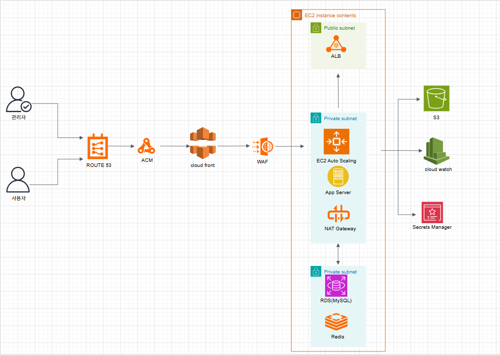
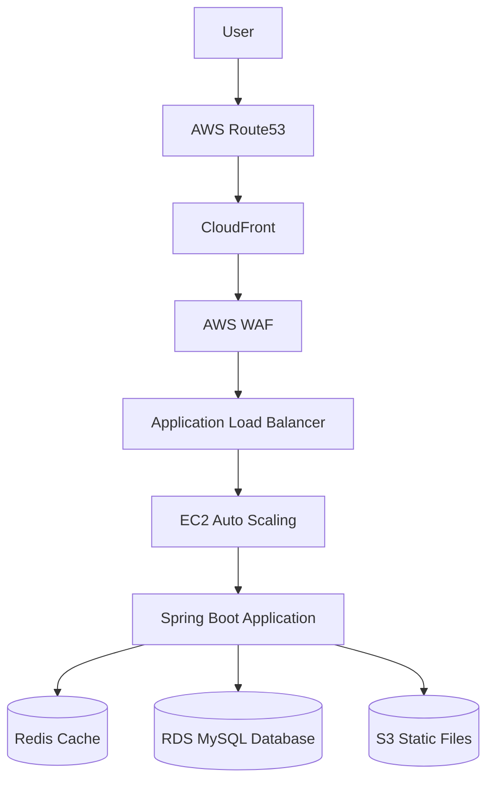
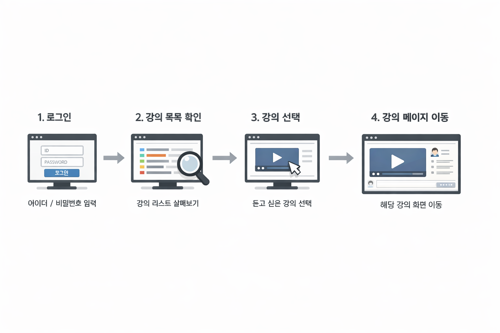

# Timothy LMS

AWS 기반으로 설계된 **Learning Management System (LMS)** 플랫폼입니다.

Timothy LMS는 강의 콘텐츠 관리, 사용자 커뮤니티, 강의 요청 기능을 제공하며  
클라우드 환경에서 **확장성(Scalability), 보안(Security), 안정성(Availability)** 을 고려하여 아키텍처를 설계했습니다.

---

# System Architecture

다음은 Timothy LMS의 전체 AWS 인프라 구조입니다.

## Architecture Overview

사용자의 요청은 다음과 같은 흐름으로 처리됩니다.

1. Route53  
   사용자 도메인 요청을 DNS 기반으로 라우팅

2. CloudFront  
   CDN을 통해 정적 콘텐츠 캐싱 및 전송 속도 개선

3. AWS WAF  
   웹 공격(SQL Injection, XSS 등) 차단

4. Application Load Balancer  
   HTTP / HTTPS 트래픽을 여러 애플리케이션 서버로 분산

5. EC2 Auto Scaling  
   트래픽에 따라 애플리케이션 서버 자동 확장

6. Application Server (Spring Boot)  
   강의, 게시판, 요청 기능 등 비즈니스 로직 처리

7. RDS (MySQL)  
   사용자, 강의, 게시글 데이터 저장

8. Redis  
   캐시 및 세션 데이터 관리

9. S3  
   이미지 및 정적 파일 저장

10. CloudWatch  
    로그 및 시스템 모니터링

11. Secrets Manager  
    DB 비밀번호 및 API Key 보안 관리

---

# CI/CD Architecture

CI/CD 파이프라인을 통해 애플리케이션 빌드 및 배포 자동화를 구성할 수 있습니다.

CI/CD 파이프라인 구성 예시

1. Source Stage  
   GitHub Repository

2. Build Stage  
   AWS CodeBuild

3. Deploy Stage  
   AWS CodeDeploy

4. Pipeline Management  
   AWS CodePipeline

코드 변경 시 자동으로 **빌드 → 테스트 → 배포**가 이루어집니다.

---

# Application Architecture

애플리케이션은 다음과 같은 계층 구조로 구성됩니다.

## Presentation Layer

- Thymeleaf  
- HTML  
- CSS  
- JavaScript  

사용자 인터페이스를 제공하며 로그인, 강의 목록, 게시판 등의 화면을 처리합니다.

---

## Application Layer

- Spring Boot  
- Spring MVC  
- Service Layer  

비즈니스 로직을 처리하며 강의 관리, 게시판 관리, 요청 기능 등을 담당합니다.

---

## Persistence Layer

- Spring Data JPA  
- MySQL  

데이터베이스와 연동하여 애플리케이션 데이터를 관리합니다.

---

# Request Flow

사용자가 강의 페이지를 요청하는 흐름입니다.

---

# Technology Stack

## Backend

- Java 21
- Spring Boot
- Spring MVC
- Spring Security
- Spring Data JPA

## Frontend

- Thymeleaf
- HTML
- CSS
- JavaScript

## Database

- MySQL
- Redis

## Cloud / Infrastructure

- AWS EC2
- AWS RDS
- AWS S3
- AWS CloudFront
- AWS Route53
- AWS WAF
- AWS CloudWatch
- AWS Secrets Manager

---

# Key Features

### Learning Management

강의 등록 및 학습 진행 관리

### Community Board

사용자 간 정보 공유 게시판

### Lecture Request

사용자가 원하는 강의 요청 기능

### User / Admin System

사용자 관리 및 관리자 기능 제공

---

# Expected Benefits

## Scalability

Auto Scaling 기반으로 트래픽 증가 대응

## Security

AWS WAF 및 Secrets Manager 기반 보안 강화

## Performance

CloudFront CDN 및 Redis 캐시 활용

## Observability

CloudWatch 기반 로그 및 모니터링

---

# Future Improvements

- CI/CD 자동 배포 파이프라인 구축
- Redis Cluster 적용
- RDS Multi-AZ 구성
- 시스템 모니터링 고도화

